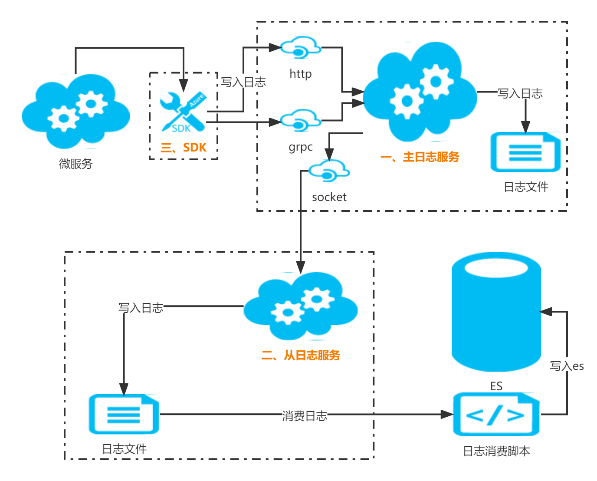

# go-modsynclog
日志汇总同步系统，共分为3部分
#### 一. 主服务 （部署外网）
>用途
1. 接收日志数据
2. 存储日志数据
3. 为内网终端同步日志提供服务
>配置端口
1. http端口(内部用)：http方式接收日志
2. grpc端口(内部用)：grpc方式接收日志
3. tcp端口(外部用)：内网通过这个端口同步日志到内网
>配置磁盘目录
1. 设置一个磁盘目录存储日志
2. (存储参见 github.com/loudbund/go-filelog/filelog_v1 )
3. 外网也可以直接解析这个日志数据加工处理

#### 二. 从服务（部署内网）
>用途
1. 作为服务端日志的从服务，
2. 日志数据和主服务数据完全一致，可能有很短延时
3. 终端脚本可以直接解析日志数据加工处理
>配置端口
1. 主服务提供的socket端口
>配置磁盘目录
1. 日志存储的目录
2. (存储参见 github.com/loudbund/go-filelog/filelog_v1 )

#### 三. 日志sdk（外网app使用）
> app引入包，初始化日志服务地址后，直接调用包函数提交日志

## 安装
go get github.com/loudbund/go-modsynclog

## 引入
```golang
import "github.com/loudbund/go-modsynclog/modsynclog_v1"
```

## 使用案例
>程序流程日志和错误日志系统


1. 部署服务端接收日志(参见example)
2. 微服务引入包，调用sdk函数写入日志到服务(参见example)
3. 内网部署客户端从服务同步日志(参见example)
4. 内网编写消费日志并写入es脚本（消费日志数据参见github.com/loudbund/go-filelog的example)
5. 在es里检索日志数据


## example
详见example-server/,example-client/